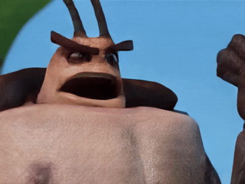
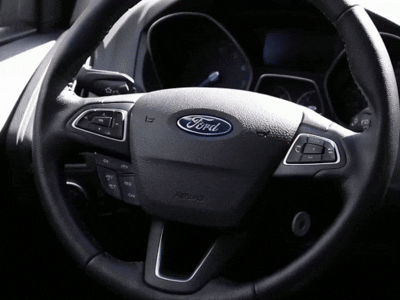
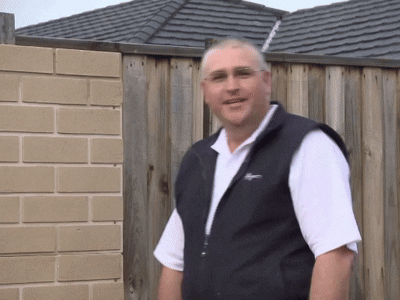
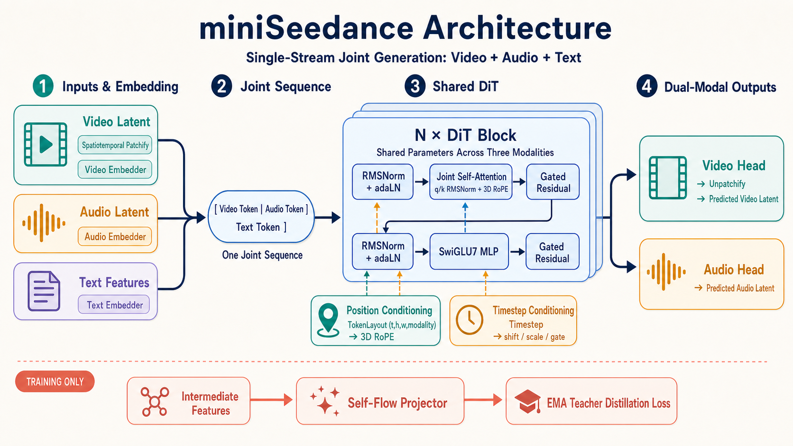

# miniSeedance

A minimal yet complete text-to-video / joint audio-video generation model. The sampling method and training objective are adopted from [Self-Flow](../Self-Flow), while the Video VAE and DiT architectures are based on [daVinci-MagiHuman](../daVinci-MagiHuman).

# Generated Samples







Pipeline overview:

```
Synthetic data (python -m src.data.synthesis.toy_video)
    │  .npz (frames + audio) + metadata.jsonl
    ▼
Data processing (python -m src.data.processing.latent_caching): Wan / Stable Audio VAE and text encoder pre-encoding
    │  cache/{latents, audio_latents, texts}.pt
    ▼
Training (train_video.py / train_ddp.sh): Self-Flow or FM, DDP + wandb + FID + in-training sampling
    │  results/<run>/ckpt_*.pt (includes the complete configuration for reproducibility)
    ▼
Inference (python -m src.sample): text → mp4/gif/wav       Evaluation (python -m src.evaluation.{toy_video,av})
```

## 0. Environment Setup

The environment is managed with [uv](https://docs.astral.sh/uv/), and dependencies are pinned in the root-level `requirements.txt` (generated by `uv pip freeze`). Run all commands below from the project root:

```bash
# Install uv (skip if already installed)
curl -LsSf https://astral.sh/uv/install.sh | sh

# Create and activate a virtual environment, then install dependencies
uv venv .venv
source .venv/bin/activate
uv pip install -r requirements.txt
```

Place model weights under `checkpoints/` (Wan2.2 VAE is required; audio/T5Gemma weights are optional):

```bash
# Wan2.2 VAE weights (about 2.8 GB; skip if already present)
python -c "from huggingface_hub import hf_hub_download; hf_hub_download('Wan-AI/Wan2.2-TI2V-5B', 'Wan2.2_VAE.pth', local_dir='./checkpoints')"
```

## 1. Data Synthesis

`src/data/synthesis/toy_video.py` generates a toy dataset in which a single colored geometric object (6 colors × 3 shapes × 3 backgrounds) moves at a constant speed in one direction (4 directions). Each caption follows the template `"a {color} {shape} moving {direction} on a {bg} background"`. Every sample also includes a stereo audio track at 44.1 kHz that encodes the motion direction: right = constant 660 Hz tone, left = constant 330 Hz tone, up = 330→660 Hz upward sweep, and down = 660→330 Hz downward sweep. Audio and video semantics are therefore tightly coupled, specifically for testing consistency in joint audio-video generation.

```bash
# 17 frames at 128x128, 3,000 samples; --width/--height support any resolution divisible by 16 (for example, 16:9)
python -m src.data.synthesis.toy_video --output-dir data/toy_video --num-videos 3000
python -m src.data.synthesis.toy_video --output-dir data/toy_169 --num-videos 3000 --width 224 --height 128
```

Output format (also the input format for custom datasets): one `.npz` file per video (`frames` as uint8 (T,H,W,3), where T = 1+4k; optional `audio` as int16 (2,N), where N is a multiple of 2048), plus one `metadata.jsonl` file (each line is `{"file_name": ..., "text": ...}`). Custom data only needs to follow this format.

## 2. Data Processing (Latent Pre-encoding)

`src/data/processing/latent_caching.py` computes the outputs of all three frozen components once, so large models do not run during training:

```bash
python -m src.data.processing.latent_caching --data-dir data/toy_video --config configs/default.json
```

Outputs under `<data-dir>/cache/`:

| File | Contents |
|---|---|
| `latents.pt` | Wan2.2 VAE video latents bucketed by resolution: `{"buckets": [(Nᵢ, 48, T′, H′, W′) fp16], "index": [original entry indices]}`, with 16× spatial / 4× temporal compression |
| `audio_latents.pt` | Stable Audio VAE audio latents as a `buckets` list aligned with the video buckets, shaped (Nᵢ, 64, Lᵢ) fp16 and globally normalized per channel (mean/std are stored for denormalization during decoding); present only when the data contains an `audio` key |
| `texts.pt` | Text token features for deduplicated captions + empty-string features (for CFG) + the text encoder configuration used |

**Real data (AVCaps)**: `src/data/processing/avcaps_semantic_split.py` converts `TUT-ARG/AVCaps` from Hugging Face (`train_videos.zip` + `test_videos.zip`, extracted to `data/avcaps/`) into the format above. Source videos are mapped to three resolutions by aspect ratio (512x384 / 512x288 / 288x512). Landscape clips alternate between 10s and 20s, while portrait clips are fixed at 10s, producing five buckets in total.

AVCaps provides about 13 descriptions per clip across four groups (`audio_visual` / `GPT_AV` / `visual` / `audio`), with substantial differences in information density. `tools/rebuild_texts.py` recomputes only the text side (`texts.pt` and the manifest, leaving video/audio latents unchanged). `--select longest` switches to the longest description (the three groups containing visual information average 24 tokens, compared with only 14 for the first description), while `--captions all` retains every description and samples a different one whenever the clip is drawn during training:

```bash
python tools/rebuild_texts.py --data-dir data/avcaps_full/train \
    --config configs/l.json --select longest --captions one
```

Changing `--select` also changes the evaluation prompts, so metrics are comparable only between runs built with the same selection method.

```bash
# Full training set (1,661 clips) + official AVCaps test split (200 clips)
python -m src.data.processing.avcaps_semantic_split --avcaps-dir data/avcaps \
    --out-dir data/avcaps_full --train-count 0 --test-source official --workers 32
python -m src.data.processing.latent_caching --data-dir data/avcaps_full/train --config configs/xxl.json
python -m src.data.processing.latent_caching --data-dir data/avcaps_full/test  --config configs/xxl.json
```

`--test-source semantic` provides an alternative split: test clips are also selected from the training pool, but every test caption is CLIP-similar to, yet distinct from, a training caption. This is useful for observing "neighbor generalization" on small datasets. The official split has no source-video overlap with the training set and should be used for reported metrics.

**Resolution bucketing**: A dataset may mix videos with different resolutions and durations. During caching, samples are grouped by (frame shape, audio length), and each group is encoded into a bucket. During training, each batch first samples a bucket with probability weighted by bucket size, then samples within that bucket, ensuring identical shapes inside the batch. The Trainer maintains an independent `TokenLayout` / RoPE coordinate system for every bucket. torch.compile specializes one static graph per shape (`dynamic=False`; the limited number of buckets keeps this manageable), and MFU is scaled using the current bucket's sequence length. Evaluation sampling and the checkpoint's default inference resolution use the largest bucket (`latent_shape`), while all bucket shapes are stored in `latent_shapes`. The legacy single-tensor cache format remains directly loadable and is treated as one bucket.

The cache records the text encoder actually used, and this information is written into the checkpoint during training so the sampling side can reconstruct matching components.

## 3. Model Architecture

A single-stream DiT processes one packed sequence `[video tokens | audio tokens | text tokens]` (`src/models/dit.py`):

```
Video latent (48,T′,H′,W′) ─ patchify ─ video_embedder ─┐
Audio latent (64,L)        ────────── audio_embedder ──┼─ [joint sequence] ─ N × DiT Block ─ video head/audio head
Text token features         ────────── text_embedder ───┘                         ▲
                                                                  per-token timestep adaLN-Zero
```

- **DiT Block** (MagiHuman style): RMSNorm pre-normalization, q/k RMSNorm, 3D RoPE attention, and a SwiGLU7 MLP; full joint spatiotemporal attention (with no separate temporal layer), where temporal information comes from VAE temporal compression and the t-axis of RoPE.
- **Positional encoding**: 3D RoPE operates on (t, h, w) coordinates. Video tokens use latent-grid coordinates; audio-token t values are converted into video-latent-frame units to align the time axis (h=w=−1); text tokens are placed at the end of the time axis. The fourth column of `x_ids` marks the modality (0=video, 1=audio). Each modality has its own embedder and output head, and channels are zero-padded to a shared width for packing.
- **Timestep conditioning**: MagiHuman's inference DiT is a distilled model without timesteps. This implementation grafts on Self-Flow's per-token adaLN-Zero (each token may have an independent t, which is required for Self-Flow masked training) and a self-distillation projector. `model.adaln` can be `per_block` (the default; each block has one hidden→6·hidden modulation Linear, following the classic DiT design and accounting for about one third of the XL model's parameters) or `single` (the PixArt-α design: the full model shares one modulation head and each block adds only a learnable bias table; XL parameters decrease from 724M to 498M, with measured convergence trajectories nearly identical to per_block).
- **Temporal patchify**: `model.patch_size_t` (default 1) merges adjacent latent frames into one token, on top of the 4× temporal compression already provided by the Wan VAE. If T is not divisible, the end of the sequence is zero-padded and cropped after unpacking (padding tokens participate in attention and the loss). On XL, patch_size_t=2 reduces the sequence from 3915 to 2155 tokens and nearly halves per-step GPU time. Fine temporal details in fast motion may degrade and should be validated on the target data. As with `adaln`, checkpoints with different values are incompatible.
- **mHC hyper-connections** (Manifold-Constrained Hyper-Connections, DeepSeek, arXiv:2512.24880): `model.mhc` (disabled by default at 0; set n>1 to enable the n-stream version). The residual state expands into n copies shaped (B, L, n, C). Every sublayer connection dynamically generates three groups of gates from the input: H_pre (sigmoid; an n-stream weighted read into the sublayer), H_post (2·sigmoid; writes the sublayer output back into every stream), and H_res (an n×n stream-mixing matrix projected by Sinkhorn-Knopp to be doubly stochastic, preserving norms through convex combinations). Initialization makes the entire connection element-wise equivalent to a standard residual connection (measured difference ~1e-6). Two algebraic simplifications make the implementation friendly to torch.compile: the norm affine is absorbed into the bias-free phi; `phi(RMSNorm(x)) ≡ phi(x)·inv_rms(x)`, so GEMM runs first and applies scalar scaling only to the (n²+2n)-dimensional output, avoiding materialization of the normalized n·C-wide tensor (the largest cost in the original implementation); stream mixing uses fused multiply-adds instead of tiny batched GEMMs with M=K=n. Measured XL step time increases from 89.6 ms (mhc=0) to 137 ms (mhc=2) / 200 ms (mhc=4; 172 ms with `train.compile_mode="max-autotune-no-cudagraphs"`). The remaining overhead is dominated by memory bandwidth for n residual streams (the FLOPs increase is tiny, so reported MFU decreases accordingly; the paper requires a custom fused kernel to reduce overhead to ~7%). In a 2,000-step overfitting smoke test, mhc=4 converged normally (FID 9.3 / FVD 1.2 / FAD 0.11); quality differences from the baseline require longer training to validate. Checkpoints are incompatible with mhc=0.
- **Frozen components** (all replaceable through configuration; see Section 6): Wan2.2 3D causal VAE (video), Stable Audio Open 1.0 VAE (audio, Oobleck 1D), and CLIP or T5Gemma (text).
- The architecture is declared through configuration: `model: {type, hidden_size, depth, num_heads, patch_size, patch_size_t, adaln, attention}`, with a default of 768×12 (≈130M). `attention` can be `flash` (default; exact softmax attention, with the eager path using FlashAttention-4 from the `flash-attn-4` package via CuTe DSL JIT on Blackwell/Hopper; automatically falls back to SDPA when the package is unavailable or under torch.compile, and automatically computes fp32 inputs in bf16), `softmax` (SDPA automatically selects a backend), or `linear` (kernelized linear attention φ(x)=elu(x)+1, O(L), which becomes faster than softmax only beyond roughly 8k tokens). All three share the same parameter structure. flash/softmax are mathematically equivalent and can exchange weights, while weights trained with linear are incompatible with the other two. The checkpoint records the selected type so inference uses the same implementation automatically.

The forward pass preserves Self-Flow's compatibility convention (`timesteps = 1 − timesteps` internally and a negated output). Training fits `MSE(−model(x_t, 1−t, text), x1 − x0)`, where `x_t = t·x1 + (1−t)·x0`.

## 4. Model Training

Two training objectives are available (`src/training/objectives.py`, selected by `train.objective`):

- **selfflow** (default): flow matching + Dual-Timestep Scheduling (each sample independently draws `t,s~p(t)`; a `mask_ratio` fraction of tokens uses `s`, while the rest uses `t`) + EMA teacher self-distillation. The teacher runs on the same noise at a unified cleaner timestep, and the student's shallow features pass through a projector for cosine alignment with the teacher's raw deep features. The code uses a reversed variable where `t=1` is clean, so the paper's `min(t,s)` corresponds to `max(t,s)` in the implementation.
- **fm**: a pure conditional flow matching baseline.

When the cache contains audio, training automatically becomes joint audio-video diffusion: both modalities are noised together in the same sequence, with `loss = fm_video + audio_weight * fm_audio` (+ the Self-Flow distillation term).

```bash
# Single GPU (configuration-driven; any key can be overridden with --set, and common options have shortcuts)
python train_video.py --data-dir data/toy_video --results-dir results/video
python train_video.py --data-dir data/toy_video --config configs/v2.json \
    --set train.objective=fm --set model.depth=24

# Multi-GPU DDP (common options use environment variables; all others pass through via --set; batch_size is per GPU)
GPUS=4 STEPS=10000 BATCH_SIZE=32 bash train_ddp.sh
WANDB_MODE=offline GPUS=2 OBJECTIVE=fm bash train_ddp.sh --set train.mask_ratio=0.25
```

During training (all options are configurable in the `train` section of `src/training/trainer.py`):

- **wandb**: Every step logs `loss / lr` and components named by training objective—`selfflow_video / selfflow_audio / distill` for self flow, or `fm_video / fm_audio` for flow matching. It also logs `mfu` (estimated FLOPs ÷ device bf16 peak; use `train.peak_tflops` for unrecognized GPUs), `tflops_per_gpu`, and cumulative `train_time_s` (`total_train_time_s` is written to the summary at the end). The run config includes `model_params`. If not logged in, wandb automatically switches to offline mode (`--no-wandb` disables it).
- **Log files**: In addition to the terminal, logging output from every script (`src/log.py`) is written to `logs/<timestamp>_<entry_script>[_rankN].log` in the project root. Non-zero DDP ranks record only WARNING and above.
- **Optimizer**: `train.optimizer` can be `adamw` (default, fused AdamW) or `muon` (based on [DiT-Muon](https://github.com/lavinal712/DiT-Muon): 2D weights inside transformer blocks use Muon—momentum + Newton-Schulz orthogonalization, with `train.muon_lr` defaulting to 1e-3—while embeddings/output heads/norms/biases use the internal auxiliary AdamW at `train.lr`; matrices with matching shapes are stacked for batched NS iterations, with an XL step taking about 47 ms). Warmup/cosine schedules scale the peak learning rates of the two groups proportionally. See `configs/xl_muon.json` for an example.
- **Training speed**: The defaults enable `train.compile` (torch.compile for the student forward/backward and EMA teacher forward, with about one minute of JIT on the first step), fused AdamW, foreach EMA, early exit at the Self-Flow teacher feature layer, and DDP bf16 gradient compression (`train.grad_compress_bf16`). Data caches up to 4 GB reside entirely on the GPU, eliminating pageable H2D synchronization on every step. On XL (724M, seq≈3.9k, bs 8), measured step time drops from 683 to 245 ms on GB300 (compiled and eager losses match element-wise). Adding `adaln=single` + `patch_size_t=2` (`configs/xl_fast.json`, 498M) reduces it further to 115 ms, giving about a 1.9× wall-clock speedup at the same loss. Experimentally rejected directions include FP8 (torchao; quantization overhead on narrow GEMMs makes it 21% slower overall), torch.compile max-autotune / cudagraphs (≤2%), and linear attention (no advantage at a 4k sequence length). Benchmark with `scripts/bench_speedups.py` (each process measures only one variant because multiple compilations in the same process contaminate each other) and `scripts/profile_step.py`. Use `--set train.compile=false` to diagnose compilation issues.
- **Generation quality metrics**: Every `train.fid.every` steps, the model samples `num_videos` videos. Following the Self-Flow paper, evaluation uses EMA weights and `cfg_scale=1` (no guidance) by default; qualitative `sample`/`test` uses EMA + CFG 5 by default, with separate configurations. When `--eval-data-dir` is provided, scoring uses that held-out dataset (metric names gain a `test_` prefix); otherwise it falls back to the training set. Evaluation clips and initial noise are drawn once and reused in every round—redrawing each round would mix clip variance into the curve and cause metrics to jump for reasons unrelated to the weights. The generation side always uses a fixed `num_videos` (the expensive side), while the real side uses all held-out clips by default (`train.fid.num_real`). Every held-out bucket is generated at its own shape and features are merged across buckets, so the scores cover the full split rather than only the largest bucket. Logged metrics:
  - `fid` (primary metric): mean per-video FID—frames from each generated video independently form a Gaussian, FID is computed against the real-frame Gaussian, and the results are averaged (implemented with a low-rank identity, requiring only a T×T feature decomposition per video); `fid_pooled` is provided as a pooled all-frame reference.
  - `fvd`: video-level Fréchet distance using features from Kinetics-400-pretrained r3d_18 (not the official I3D-based FVD, but constructed the same way).
  - `clip_score`: mean CLIP (ViT-B/32) cosine similarity between eight uniformly sampled frames and the caption ×100, measuring text consistency.
  - `fad` (when audio is present): Fréchet Audio Distance using VGGish features (AudioSet-pretrained, one 128-dimensional embedding per 0.96s; stereo is averaged to mono and internally resampled to 16 kHz).

  `fid_paired` is also available: each generated video is compared only with the real clip specified by its caption. Because both sides contain the same content and have matching covariance shapes, it can approach zero. In contrast, `fid` compares frames from one video against the entire real set and therefore has a covariance-mismatch lower bound that can remain insensitive for a long time.

  Both sides pass through VAE decoding to eliminate reconstruction differences. At scales of only dozens of clips, all metrics should be treated as trend indicators. For reported values, run the full split through `tools/eval_test_set.py` (see Section 7).
- **In-training sampling**: Every `train.sample.every` steps, random training captions are used to generate videos (including audio; raw weights by default, switchable with `train.sample.use_ema`). Results are saved to `results_dir/samples/step*.mp4` and uploaded to wandb. With held-out data, every `train.test.every` steps an additional random held-out clip is selected, and the real clip plus a generation from the same prompt are saved as a pair under `results_dir/test_samples/` and uploaded to wandb. The single example is only for visual inspection; scores come from the held-out metrics above.
- Each checkpoint stores the model / EMA / optimizer / fully resolved configuration / latent shape / audio metadata.

## 5. Inference

`src/sample.py` automatically reconstructs all matching components (text encoder, video VAE, and audio VAE) from the checkpoint, so no separate configuration is needed:

```bash
python -m src.sample --ckpt results/video/ckpt_last.pt \
    --prompts "a red circle moving right on a white background"

# Resolution override (must be divisible by 16; quality degrades outside the training resolution due to RoPE extrapolation)
python -m src.sample --ckpt results/video/ckpt_last.pt --width 224 --height 128 \
    --prompts "..."
```

Each prompt outputs an `.mp4` (H.264; a joint AV model automatically muxes in an AAC audio track), a `.gif`, a frame-strip `.png` (and a `.wav`). When no explicit arguments are provided, the CLI reads mode, steps, sampleshift, CFG, and weight type from the checkpoint's qualitative sampling configuration. The paper uses a 50-step ODE, sampleshift 15, EMA weights, and CFG 5 for WAN2.2 video. Command-line arguments can still override each setting individually, and `--no-ema` forces raw weights.

## 6. Configuration System

The model architecture, components, and complete training recipe are defined together in `configs/*.json`:

```jsonc
{
  "model":        { "type": "video_dit", "hidden_size": 768, "depth": 12, "num_heads": 12, "patch_size": 1, "patch_size_t": 1, "adaln": "per_block", "attention": "flash", "mhc": 0 },  // adaln: per_block | single; attention: flash | softmax | linear; mhc: 0 disabled | n>1 number of streams
  "text_encoder": { "type": "clip",  "name_or_path": "openai/clip-vit-base-patch32", "text_len": 16 },   // or type=t5gemma
  "video_vae":    { "type": "wan2.2", "path": "checkpoints/Wan2.2_VAE.pth" },
  "audio_vae":    { "type": "stable_audio", "path": "checkpoints/stable-audio-open-1.0" },
  "train":        { "objective": "selfflow", "steps": 6000, "lr": 1e-4, "...": "see src/config.py TRAIN_DEFAULTS" }
}
```

- **Pluggable components**: Each component is built from the registry by `type` (`src/models/registry.py`). Adding a VAE / text encoder / DiT implementation only requires writing the implementation class and registering its factory with `register_*`; callers require no changes.
- **Override mechanism**: Missing keys in the `train` section fall back to `TRAIN_DEFAULTS`. Any key can be overridden with `--set a.b.c=value` (values are parsed as JSON).
- **Reproducibility**: Checkpoints carry the fully resolved configuration, allowing sampling/evaluation to reconstruct the same components directly.
- Ready-made configurations: `default.json` (baseline), `v2.json` (improved recipe: cosine+warmup+lognorm+distillation warmup), `t5gemma.json` (uses T5Gemma), `xl.json` (1280×24), `xl_fast.json` (XL + adaLN-single + temporal patchify, about 2.1× faster), and `xl_muon.json` (XL + Muon optimizer).

## 7. Evaluation

**Full held-out evaluation (real data)**: `tools/eval_test_set.py` scores a checkpoint over an entire cached split using the same construction as training-time evaluation, but processes every clip and reports per-bucket breakdowns. Use this for reported values; training-time metrics are for trends only.

```bash
python tools/eval_test_set.py --ckpt results/<run>/ckpt_last.pt \
    --data-dir data/avcaps_full/test --out results/<run>/test_metrics.json
# Guidance sweep: decode/extract real features only once and share them across cfg values
python tools/eval_test_set.py --ckpt results/<run>/ckpt_last.pt \
    --data-dir data/avcaps_full/test --cfg 1.0 2.0 3.0 5.0 --num-videos 40
# Optional: --weights ema, --num-steps, --mode/--shift (defaults come from the checkpoint's sampling configuration)
```

When `--cfg` receives multiple values, results are tabulated one row per cfg. Training-time metrics are always measured at `cfg=1.0`. At cfg=1, a model trained for generalization produces something close to the conditional mean and therefore tends to be blurry, systematically increasing FID. Run a guidance sweep before reporting results.

Generated audio latents are denormalized using the training-set statistics stored in the checkpoint (the space the model learned), while real clips use the statistics of their own split.

**Two automated evaluation scripts for the toy dataset**, both based on pixel/spectrum heuristic classifiers (100% accurate on real data and VAE reconstructions):

- **`src/evaluation/toy_video.py`** — Prompt fidelity: generates all 216 combinations one by one and classifies color (nearest palette entry), shape (occupancy of the four bounding-box corners), background, and motion direction (centroid displacement between the first and last frames), reporting accuracy for each attribute and for all attributes jointly.

```bash
python -m src.evaluation.toy_video --ckpts selfflow=results/video/ckpt_last.pt \
    fm=results/video_fm/ckpt_last.pt --seeds 0 1
```

- **`src/evaluation/av.py`** — Audio-video consistency (joint AV checkpoints): video direction is classified as above; audio direction is determined from the dominant frequencies in the first and last 0.4s windows (constant 660/330 Hz vs upward/downward sweep). It reports video accuracy, audio accuracy, and AV consistency.

```bash
python -m src.evaluation.av --ckpt results/av_sf/ckpt_last.pt
```

To compare the Self-Flow and FM objectives, train one checkpoint for each with the same configuration and pass both to `--ckpts label=path` for joint evaluation. The paper setting uses EMA weights; raw weights can be selected explicitly when needed for diagnosis.

## 8. Code Structure

```
mini-agnes-video/
├── requirements.txt               # Locked dependencies generated by uv pip freeze
├── configs/                       # default.json / v2.json / t5gemma.json
├── checkpoints/                   # Wan2.2_VAE.pth / stable-audio-open-1.0/ / t5gemma-2b-2b-ul2-it/
├── logs/                          # Runtime logs for all entry scripts (generated automatically)
├── train_video.py                 # Training entry point -> src/training/trainer.py (--set overrides any configuration)
├── train_ddp.sh                   # torchrun DDP launcher
├── tools/                         # One-off diagnostic/evaluation scripts
│   ├── eval_test_set.py           # Full-split FID/FVD/CLIP/FAD + per-bucket breakdown
│   ├── probe_train_test_gap.py    # Training/held-out loss comparison (by modality and t, including blind reference)
│   ├── probe_sampler_ab.py        # Sampler comparison on the same checkpoint
│   ├── probe_text_dependence.py   # Held-out loss with true/swapped/empty captions + CFG conditioning-difference vectors
│   ├── probe_conditioning.py      # Data side: capacity accounting, caption crowding, caption→latent R²
│   ├── rebuild_texts.py           # Recompute only the text cache (change caption selection strategy / text_len)
│   ├── probe_latent_recon.py      # Metric floor from VAE round-trip reconstruction
│   └── probe_loss_by_bucket.py    # Loss distribution by bucket / t
└── src/
    ├── config.py                  # Configuration loading + TRAIN_DEFAULTS + --set dotted-path overrides
    ├── log.py                     # Unified logging configuration (non-rank-0 DDP processes emit WARNING+ only)
    ├── inference.py               # sample_latents / sample_videos (shared by training and sampling)
    ├── sample.py                  # Sampling CLI: python -m src.sample
    ├── media.py                   # gif / frame strip / wav / mp4 output
    ├── sampling.py                # denoise_loop (adapted directly from Self-Flow)
    ├── utils.py                   # TokenLayout: token sequence packing/unpacking/position IDs
    ├── data/
    │   ├── synthesis/
    │   │   └── toy_video.py       # Synthetic data: python -m src.data.synthesis.toy_video
    │   ├── processing/
    │   │   ├── latent_caching.py  # Data processing: python -m src.data.processing.latent_caching
    │   │   ├── avcaps_subset.py   # Low-level AVCaps subset decoding/cropping/resolution bucketing
    │   │   └── avcaps_semantic_split.py  # AVCaps train/test split (full set + official test)
    │   └── latent_cache.py        # Training cache loading + random batches
    ├── evaluation/
    │   ├── toy_video.py           # Prompt-fidelity evaluation: python -m src.evaluation.toy_video
    │   └── av.py                  # Audio-video consistency evaluation: python -m src.evaluation.av
    ├── models/
    │   ├── registry.py            # Component registry (type -> factory)
    │   ├── dit.py                 # Text-conditioned Video DiT (MagiHuman + Self-Flow conditioning)
    │   ├── video_vae.py           # Wan2.2 3D VAE (adapted directly from daVinci-MagiHuman)
    │   ├── audio_vae.py           # Stable Audio Open VAE (adapted directly from daVinci-MagiHuman sa_audio)
    │   └── text_encoders.py       # Frozen text encoders: CLIP + T5Gemma (adapted directly from MagiHuman)
    └── training/
        ├── trainer.py             # Trainer: DDP / EMA / LR scheduling / wandb / FID / sampling / checkpoints
        ├── objectives.py          # FlowMatching / SelfFlow training objectives
        ├── fid.py                 # InceptionV3 frame-level FID
        └── distributed.py         # torchrun process group
```
